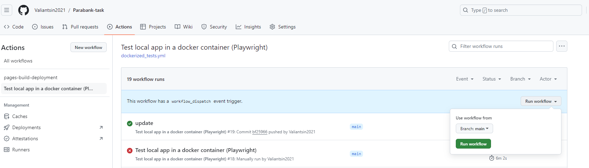

# Playwright automation testing framework <a href="https://playwright.dev/" target="blank"></a>

## Welcome to the Playwright Testing Framework Readme! This document provides an overview of the project structure, the tools and technologies used, and how to set up and run tests using Playwright with JavaScript. 

## SUT is "Parabank" web application

### Author

### [Valiantsin Lutchanka](https://www.github.com/Valiantsin2021)

[](https://choosealicense.com/licenses/mit/) [](https://github.com/Valiantsin2021/Parabank-task/actions/workflows/pages/pages-build-deployment) [](https://github.com/Valiantsin2021/Parabank-task/actions/workflows/dockerized_tests.yml) [](http://makeapullrequest.com)

[](https://forthebadge.com)


[](https://www.linkedin.com/in/valiantsin-lutchanka/) [](https://valiantsin2021.github.io/Portfolio-Valentin/)

Framework is implemented as a monorepository. If you are going to implement new tests please create you branch, make your changes and create pull request. 

## [Latest Allure report](https://valiantsin2021.github.io/Parabank-task)

## 1. Framework structure

- Fixtures containing temp test data, downloads, schemas, constants and Playwright fixture files (merged) `./fixtures`
- POM with page classes `./pages`
- Tests divided by 'Smoke_tests', 'UI_tests', and 'Visual_tests' suites
- Tests divided per types by directories `./projects`: all tests have tags annotations to run selectively with grep
- Automated documentation generation based on JSDOC comments `./docs`
- Utils modules `./utils` contains test data factory and csv reader module in `./utils/data_processors` and Monocart reports merger module in `./utils/report_utils`
- sh scripts with various launch scenarious `./scripts`
- Junit and Monocart reports `./report`
- Allure report `./report/allure-report`

### 1 UI functional tests

Scenarios:

- Register a new user and check the mandatory fields. 
- Login / logout, check the welcome message as well as a default account exists. 
- Update user information and check if it is updated properly. 
- Create a new account, check if it is created properly in the Account Overview section and has the 
minimum amount required. 
- Pay a bill, check the mandatory fields and find the transaction by ID, date and amount. 
- Transfer an amount between accounts and check if the transaction was successful. 
- Request a loan with a down payment higher than the amount of the account given, means the loan is 
“Denied“. 
- Request a loan with a down payment lower or equal to the amount of the account given, means the loan is 
“Approved“. Check a new account is created with the amount requested.

Implementation:

- UI tests use POM pattern for the logics abstraction and data driven approach with pairwise tables (`./fixtures/test_data/`)
- Test user creation is randomized with data builder (based on @faker-js/faker library)
- Test user creation abstracted to auth_ui.setup.js (run as setup before the tests)
- Test users for each test run saved in `./fixtures/test_data/user.json` and `./fixtures/test_data/@register_test_user.json`
- UI tests leverage fixtures to reduce the boilerplate

## 1.1 Visual regression tests

- Visual tests isolated in a separate project (test suite)
- Visual tests run only if CI environment variable `CI=true` is set and should be run on Docker container for screenshot consistency
- Screenshots templates for visual tests located in `.snapshots` folder and grouped per test

## 2. Functionalities

- Data builder factory using faker library
- CVS handler module to consume csv data files
- Dockerfile parametrized with shell script
- Static analysis via Code linting and formatting (eslint + prettier)
- Jsdoc generation with script `npm run docs`
- Precommit hook for staged files using Husky
- GitHub Actions to run tests dockerized on CI
- Monocart and Allure reports integrated

## 4. Node Modules

This directory contains Node.js modules and dependencies. It's generated when you run `npm install`.

## 5. Report

The `report` directory contains XML and Monocart/Allure HTML reports for tests.

## 6. Scripts

Scripts are provided for various tasks, including running specific tests and test suites.

Main scripts are located in `package.json` file.

Shell scripts - in `./scripts` directory

```shell
#script to build docker image and run tests in a container
docker_build_and_run.sh

#script to run tests depending on the environmental variables
parametrized_run.sh
```

## 7. Installation

### Before the local test run make sure to have NodeJS (v^16.0), npm (v^8.5) and Java (for allure report v8) installed

1. Clone this repository to your local environment.
2. Navigate to the project's root folder.
3. Run `npm install` to install the required dependencies.
4. Install browsers with ```npx playwright install```
5. To run tests - open terminal and navigate to the path of the cloned project and run one of the commands from the package.json:
   - to run test for appropriate project see "scripts" part of package.json file
   - to clean reports directory and screenshots: `npm run clean`
   - to open report run : `npm run report`
   - report is created in folder ./report/allure-report (index.html can be opened directly)
   - all test scripts commands you can find in ./package.json file

## 8. Running Tests

To run tests, use the provided scripts in the `scripts` part of the package.json file. Scripts can be run with the command: `npm run <scriptname>`

- `postinstall`: utility script.
- `clean`: Clean all temporary folders.
- `pretest`: Clean the reports folders from previous runs
- `test`: Run tests.
- `posttest`: Generate allure and monocart reports after the tests.
- `docker:run`: Build Docker image and run tests in a container
- `ci:run`: Run tests depending on ENV variables on CI
- `report`: Open allure report in browser.
- `format`: Utility script to pretify codebase.
- `lint`: Utility script to lint the code and error checks.
- `docs`: Utility script to generate JSDocs documentation.

If you need to run only smoke o ui tests, use the command: 

1. `npx playwright test --project=Smoke_tests` or `npx playwright test --project=UI_tests` respectivelly

or

2. `npx playwright test --grep smoke` or `npx playwright test --grep user account`

## 9. Custom Fixtures

Projects related fixtures can be found within the `fixtures` folder. 

- There are fixture files per project for the tests setup
- constants files
- test data, and temp data folders

## 10. Test Data

Test data is essential for testing. It's organized under the `test_data` subdirectory within fixtures folder. It contains csv files with pairwise tables to test error messages for different scenarios.

## 11. Allure Reporting

Allure reports provide detailed information about test execution.

- To generate the report manually, use the command: `npm run report` or `npm run posttest`
   
## 12. Docker

1. Use Shell script to buid the docker image depending on the current Playwright version and run tests in a container

on Linux:

`sh ./scripts/docker_build_and_run.sh`

on Windows:

`docker  build -t  playwright-test  -f ./utils/docker/Dockerfile  --build-arg PW_VERSION="v<current playwright version number from package.json>" .`

`docker run --rm -it -v ${pwd}:/app -w /app playwright-test npm test`

## 13. Run on CI

Github Actions is set up to run tests in a Docker container and publish the test report on https://valiantsin2021.github.io/Parabank-task

Tests run triggered on push event on "main" branch or manually via the GitHub UI


 
## 14. Additional Information and Resources

The Parabank app sometimes has internal server errors trriggered by the test case `pay bill happy path flow` in user_paybill.ui.spec.js


For further information or assistance, please refer to the resources provided in this framework.

Thank you for choosing our Playwright Testing Framework. Happy testing!

## 15. Work on tests creation:

1.  Create a branch form the framework master branch
2.  Write and debug your tests
3.  Push the code to the repository
4.  Create pull request to merge your changes to the main code of the framework

## 🔗 Links

[](https://valiantsin2021.github.io/Portfolio-Valentin/)
[](https://www.linkedin.com/in/valiantsin-lutchanka/)
